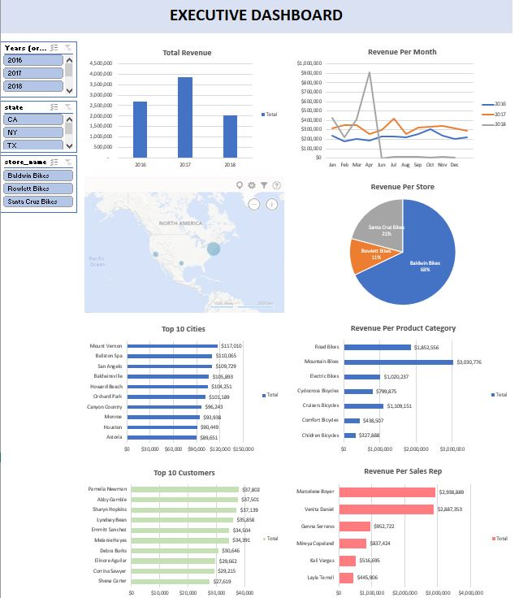
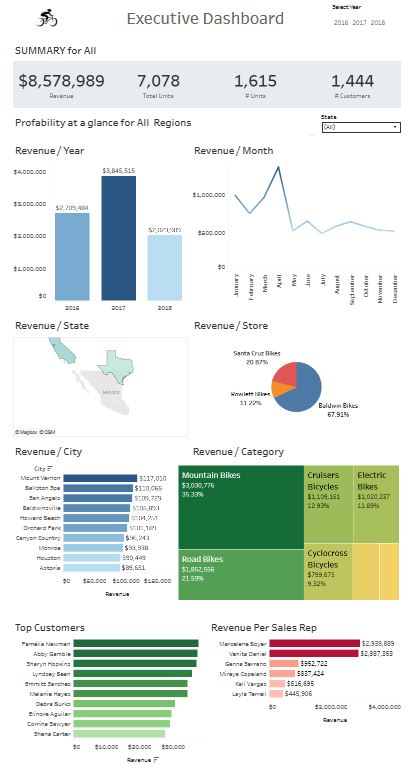

# BikeStore-Analytics
This project leverages SQL, Excel, and Tableau to create an interactive analytics dashboard that provides insights into sales performance and customer data. The workflow involves data preprocessing, data cleaning and data visualization.

 

# Files 

- [SQL-Server-Sample-Database.zip](SQL-Server-Sample-Database.zip): The original SQL Server database file. This contains the raw data tables for the bike store.

- [SQL-Data-Cleaning](SQL-Data-Cleaning): This is the SQL scripts used to query and clean the raw data from the database.

- [BikeStores.xlsx](BikeStores.xlsx): The Excel file that holds the cleaned and prepared data. This data has been preprocessed and is ready to be used for visualization.

- [BikeStore_Dashboard.twbx](BikeStore_Dashboard.twbx): The Tableau packaged workbook file. This file contains the complete interactive dashboard, including the visualizations and the data source.

- [Tableau-Link](Tableau-Link): This is a direct link to the published Tableau dashboard on Tableau Public.

 

# How to Run

### 1. Set Up the Database
 - First, you need to get the raw data from [SQL-Server-Sample-Database.zip](SQL-Server-Sample-Database.zip).

 - Unzip the [SQL-Server-Sample-Database.zip](SQL-Server-Sample-Database.zip) file.

 - Open the database file in a Microsoft SQL Server client (SQL Server Management Studio).

### 2. Extract and Clean Data with SQL

 - Open the SQL query file [SQL-Data-Cleaning](SQL-Data-Cleaning) in your SQL client.

 - Then, open an empty query and past the SQL code and execute the query.

### 3. Prepare Data in Excel
 - The [BikeStores.xlsx](BikeStores.xlsx) is an excel file with the pivot tables and executive dashboard.

 - The dashboard is interactive allowing you to change the state, year or store and all the graphs will change based on the input.

### 4. Visualize with Tableau

 - To view the dashboard without any software, click the provided [Tableau-Link](Tableau-Link) to open it on Tableau Public.

 - To explore the dashboard locally or modify it, download and open the [BikeStore_Dashboard.twbx](BikeStore_Dashboard.twbx) file using Tableau Desktop.

 - The dashboard is interactive and by swithching the year and/or state all the other graphs will change based on input.

 

## Screenshots

  
  

